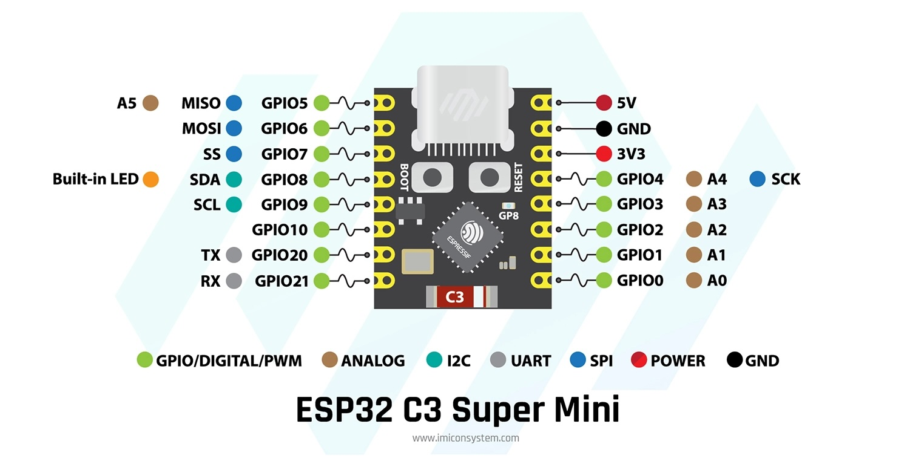

# โปรเจกต์: ไฟกะพริบ ESP32-C3

นี่คือโปรเจกต์พื้นฐานสำหรับ ESP32-C3 Supermini เพื่อทำให้ LED ในตัวกะพริบ

## วิธีการอัปโหลดโค้ด

1.  **ตั้งค่า Arduino IDE:**
    *   ไปที่ `File > Preferences` และเพิ่ม URL ของ ESP32 board manager: `https://raw.githubusercontent.com/espressif/arduino-esp32/gh-pages/package_esp32_index.json`
    *   ไปที่ `Tools > Board > Boards Manager...` ค้นหา `esp32` และติดตั้ง
2.  **เลือกบอร์ด:**
    *   ในเมนู `Tools > Board` เลือก `ESP32C3 Dev Module`.
3.  **เลือกพอร์ต:**
    *   เชื่อมต่อบอร์ด ESP32-C3 ของคุณกับคอมพิวเตอร์
    *   ในเมนู `Tools > Port` เลือกพอร์ต COM ที่ถูกต้อง
4.  **เข้าสู่โหมด Bootloader:**
    *   กดปุ่ม `BOOT` ค้างไว้
    *   กดปุ่ม `RESET` หนึ่งครั้งแล้วปล่อย
    *   ปล่อยปุ่ม `BOOT`
5.  **อัปโหลด:**
    *   คลิกปุ่ม `Upload` (ลูกศรขวา) ใน Arduino IDE

## ภารกิจท้าทาย: ไฟกะพริบภายนอก

**เป้าหมาย:** แก้ไขโค้ดเพื่อทำให้ LED ภายนอกที่เชื่อมต่อกับ `GPIO 0` กะพริบ

**อุปกรณ์ที่ต้องใช้:**
*   LED 1 ดวง
*   ตัวต้านทาน 220Ω 1 ตัว
*   สายไฟ

**ขั้นตอน:**
1.  เชื่อมต่อ LED ภายนอกเข้ากับ `GPIO 0` ผ่านตัวต้านทาน
2.  แก้ไขไฟล์ `esp32c3blink.ino` เพื่อเปลี่ยน `ledPin` จาก `8` เป็น `0`
3.  อัปโหลดโค้ดและดูผลลัพธ์!
