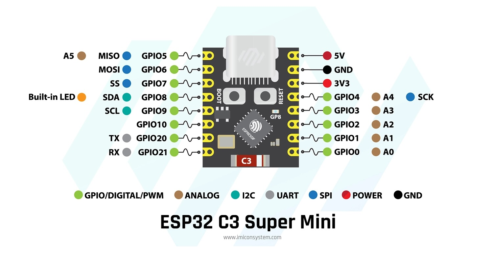

# โปรเจกต์: อ่านค่าเซ็นเซอร์ AHT20 และ BMP280 ด้วย ESP32-C3

โปรเจกต์นี้จะแสดงวิธีการอ่านค่าอุณหภูมิ, ความชื้น (จาก AHT20) และความกดอากาศ (จาก BMP280) โดยใช้ ESP32-C3 Supermini และแสดงผลผ่าน Serial Monitor

## อุปกรณ์ที่ต้องใช้

*   ESP32-C3 Supermini
*   เซ็นเซอร์ AHT20 (บน breakout board)
*   เซ็นเซอร์ BMP280 (บน breakout board)
*   แผงวงจร (Breadboard)
*   สายไฟ

## การเชื่อมต่อวงจร (Wiring)

เซ็นเซอร์ทั้งสองตัวนี้ใช้วิธีการสื่อสารแบบ I2C เราจึงสามารถเชื่อมต่อเข้ากับบัส I2C เดียวกันได้

1.  **เชื่อมต่อไฟ:**
    *   เชื่อมต่อขา **3V3** ของ ESP32-C3 เข้ากับขา VDD ของ sensor module
    *   เชื่อมต่อขา **GND** ของ ESP32-C3 เข้ากับขา GND ของ sensor module

2.  **เชื่อมต่อสายข้อมูล I2C:**
    *   ESP32-C3 Supermini ใช้ **GPIO 8** เป็น **SDA** และ **GPIO 9** เป็น **SCL** โดยปริยาย
    *   เชื่อมต่อขา **SDA** ของ ESP32-C3 (GPIO 8) เข้ากับขา **SDA** ของ AHT20 และ BMP280
    *   เชื่อมต่อขา **SCL** ของ ESP32-C3 (GPIO 9) เข้ากับขา **SCL** ของ AHT20 และ BMP280

## การทำงานของโค้ด

1.  **Include Libraries:**
    *   `Wire.h`: สำหรับการสื่อสารแบบ I2C
    *   `Adafruit_AHTX0.h`: ไลบรารีสำหรับเซ็นเซอร์ AHT20
    *   `Adafruit_BMP280.h`: ไลบรารีสำหรับเซ็นเซอร์ BMP280

2.  **Pin Definitions:**
    *   `I2C_SDA` และ `I2C_SCL` ถูกกำหนดไว้ที่ขา 8 และ 9 ตามลำดับ ซึ่งเป็นค่าเริ่มต้นของ ESP32-C3 Supermini

3.  **`setup()`:**
    *   เริ่มต้นการสื่อสารผ่าน Serial Monitor ที่ความเร็ว 115200
    *   เริ่มต้นการสื่อสาร I2C ด้วย `Wire.begin(I2C_SDA, I2C_SCL)`
    *   เริ่มต้นการทำงานของเซ็นเซอร์ `aht` และ `bmp`
    *   หากหาเซ็นเซอร์ตัวใดตัวหนึ่งไม่พบ จะมีข้อความแจ้งเตือนแสดงขึ้นมา
    *   ตั้งค่า `bmp` ให้ทำงานในโหมดปกติพร้อมการตั้งค่าพื้นฐาน

4.  **`loop()`:**
    *   อ่านค่าอุณหภูมิและความชื้นจาก AHT20 และเก็บในตัวแปร `temp_aht` และ `humidity`
    *   อ่านค่าอุณหภูมิและความกดอากาศจาก BMP280
    *   พิมพ์ค่าที่อ่านได้ทั้งหมดออกทาง Serial Monitor
    *   หน่วงเวลา 2 วินาทีก่อนที่จะอ่านค่ารอบถัดไป

## การติดตั้งไลบรารี

คุณต้องติดตั้งไลบรารีต่อไปนี้ผ่าน `Tools > Manage Libraries...` ใน Arduino IDE:
*   `Adafruit AHTX0`
*   `Adafruit BMP280 Library`
*   `Adafruit Unified Sensor` (เป็น dependency ของไลบรารีอื่น)

## Setting ก่อน upload code
*   ที่เมนู Tools เลือก USB CDC On Boot "Enabled"
*   หลัง upload code แล้วให้กด icon วงกลมมุมบนขวาของหน้าต่าง เพื่อแสดง Serial Monitor ซึ่งจะแสดงค่าที่อ่านได้จาก sensor ออกมา
*   ถ้าตัวหนังสือที่พิมพ์ออกมาเป็นตัวอักษรแปลก ๆ อ่านไม่รู้เรื่อง ให้เลือก option 115200 baud ที่หน้าต่าง Serial Monitor 

